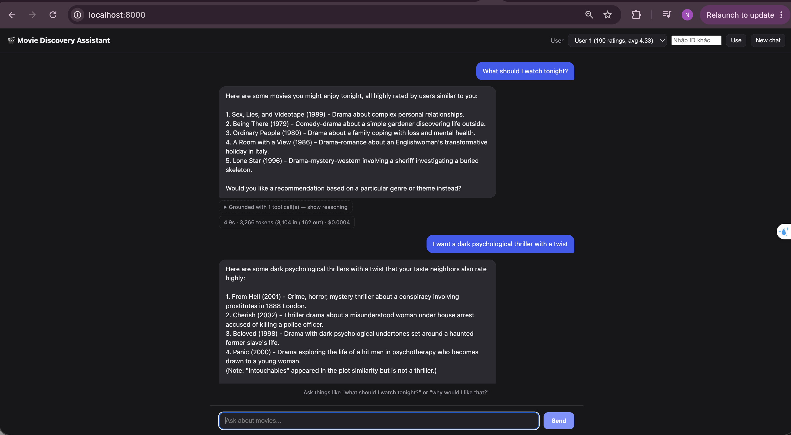
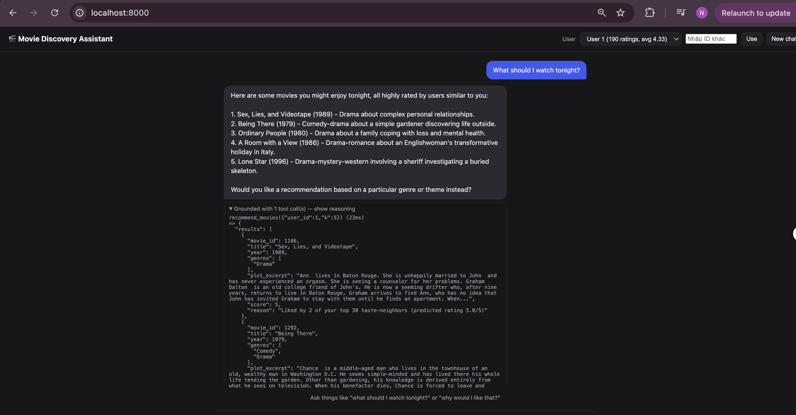

# TrustedAI - AI Engineer Test

## Setup

Requires Python 3.11+ and [uv](https://docs.astral.sh/uv/).

```bash
# 1. Install dependencies
uv sync

# 2. Configure your OpenAI API key
cp .env.example .env
# then edit .env and set OPENAI_API_KEY=...

# 3. (Optional) sanity-check the dataset is in place
uv run python scripts/verify_dataset.py

# 4. Run the app
cd src
uv run uvicorn api.main:app --reload
```

Open http://localhost:8000 in a browser, pick one of the suggested user IDs (see below), and chat.



Expanding "show reasoning" under a reply reveals the tool calls that grounded it:



Plot embeddings are already precomputed and committed under `data/embeddings/`, so no build step
is required before first run. To regenerate them (e.g. after changing the embedding model), run
`uv run python scripts/build_embeddings.py` from the repo root.

**Tests and evaluation** (from the repo root):

```bash
uv run pytest                                    # unit tests
uv run python -m evaluation.run_eval             # quantitative metrics -> results/metrics.json
uv run python evaluation/run_sample_conversations.py  # sample chats -> results/sample_conversations.md
```

`run_sample_conversations.py` requires `OPENAI_API_KEY` set (it drives the real LLM end-to-end);
`run_eval.py` does not (it only exercises the collaborative-filtering/popularity baselines). Both
outputs are already committed under `results/` for review without running anything.

### Logging & cost tracking

Every `/api/chat` turn is appended as one JSON line to `data/chat_logs/chat-YYYY-MM-DD.jsonl`
(one file per UTC day, gitignored — this is runtime data, not sample output). Each line has:

- `turn_id`, `session_id`, `user_id`, `timestamp`, `status` (`ok` or `error`)
- `message` / `reply` — the user's message and the assistant's final answer
- `tool_trace` — every tool call made to ground the answer, with arguments, result, and `latency_ms`
- `metrics` — `llm_calls`, `prompt_tokens` / `completion_tokens` / `cached_prompt_tokens`, `llm_latency_ms`,
  `tool_latency_ms`, `total_latency_ms`, and `cost_usd` (estimated from `LLM_PRICE_*` in `.env.example`,
  `null` if pricing isn't configured)
- on failure: `error` (exception type + message) instead of `reply`/`tool_trace`/`metrics`

The same per-turn numbers (latency, tokens, cost) are also returned in the `/api/chat` response and
shown under each assistant reply in the UI, so you don't have to open the log file to see them live.

OpenAI calls already retry transient errors (rate limits, timeouts, connection/5xx) up to 4 times
with exponential backoff (`tenacity`, see `src/llm/openai_client.py`); each retry attempt is logged
via stdlib `logging` to stdout. There's no fallback to another model/provider — a persistent failure
still surfaces as a 500, and the failed turn is recorded in the JSONL log with `status: "error"`.

## The Problem

You have a dataset of movies with plot summaries, user ratings, and tags. Your task:

**Build an AI assistant that helps users discover movies by investigating the dataset on their behalf.**

This is not a search engine — the assistant should reason about what to look up, combine multiple data signals, and explain its thinking. When a user asks "why would I like that?", the assistant should be able to dig into their rating history, find patterns, and give a grounded answer.

### Requirements

1. The user identifies themselves (e.g., by user ID), and the assistant uses their rating history to personalize recommendations
2. The assistant can answer questions that require combining multiple pieces of information — e.g., "what do people with similar taste to mine think of Inception?" requires finding similar users, checking their Inception ratings, and synthesizing
3. The assistant explains its reasoning using historical data — not just LLM knowledge
4. Evaluate your system's recommendation quality with evidence — show where it works and where it fails (you might use metrics, qualitative examples, or both — explain why you chose what you chose)

How you get there is up to you.

## Dataset

Located in `data/ml-latest-small-filtered/`:

| File | Size | Description |
|------|------|-------------|
| `movies_with_plots.csv` | 16MB | 5,135 movies — `movieId`, `title`, `year`, `genres`, `plot` (100–5,000+ chars, avg ~3,200) |
| `ratings.csv` | 1.7MB | 74,064 ratings from 610 users — `userId`, `movieId`, `rating` (0.5–5.0), `timestamp` |
| `tags.csv` | 74KB | 2,440 user-generated tags — sparse, most movies have none |
| `links.csv` | 98KB | External links (IMDb, TMDB) |
| `movies.csv` | 228KB | Basic movie info without plots |

**Data notes:**
- Movies span 1903–2014. This is a filtered subset of MovieLens — some well-known movies (e.g., The Matrix, Ocean's Eleven) may be absent due to missing plot data in the source.
- ~51% of movies have fewer than 5 ratings.
- Tags are very sparse (2,440 tags across 5,135 movies). Don't build your approach around tags alone.
- Users have ~121 ratings on average — relatively dense on the user side. The sparsity is on the movie side.

### What's in the data

The dataset gives you several signals to work with:

- **Rating patterns:** 610 users × 5,135 movies. Users who rate similar movies similarly have similar taste — this is the basis of collaborative filtering. You can find "users like me" and see what they enjoyed.
- **Plot summaries:** Full text descriptions (avg ~3,200 chars). Useful for content-based search — finding movies that match a description like "dark thriller with a twist."
- **Genres:** 19 genres per movie (pipe-separated). Useful for filtering, profiling user preferences, and finding blind spots.
- **Tags:** User-generated labels like "twist ending", "atmospheric", "dark comedy". Sparse but high-signal where they exist.

### Suggested users for testing

These users have different profiles — useful for testing personalization:

| User ID | Ratings | Avg | Profile |
|---------|---------|-----|---------|
| 1 | 190 | 4.33 | Action/comedy fan — likes Terminator, Blues Brothers, Full Metal Jacket |
| 15 | 85 | 3.55 | Sci-fi oriented — likes Aliens, Star Wars, Back to the Future |
| 30 | 18 | 4.61 | Sparse history — likes Braveheart, Inception, Shawshank Redemption |

### Sample Queries

Use these to sanity-check your system during development:

- "What should I watch tonight?" *(requires knowing the user's taste)*
- "I want a dark psychological thriller with a twist" *(content search + quality filter)*
- "What do people with similar taste to mine think about Pulp Fiction?" *(find similar users + aggregate their ratings)*
- "Why do you think I'd like that?" *(explain using user's history + movie data)*
- "I liked Toy Story but I'm tired of animated movies — what else?" *(use history + apply constraints)*
- "What's my blind spot? What genres am I missing?" *(analyze user's rating patterns)*

## Deliverables

### 1. Code
- Working implementation with setup instructions
- Include reproducible output: sample conversations, evaluation results, or screenshots that demonstrate the system working
- If your solution uses external APIs (e.g., OpenAI), document this and include example outputs so we can evaluate without running it

### 2. Report
Follow the template in `REPORT_TEMPLATE.md`. **This is as important as the code.**

We weight the report equally with the code. A mediocre system with excellent analysis beats a good system with a shallow report.

### 3. Interview
You will:
- Demo your system live
- Walk us through your report
- Discuss your decisions and tradeoffs

## Time

3-4 hours. Rough guide: ~2 hours building, ~1 hour on the report and evaluation, ~30 min cleanup.

Tip: keep notes on your decisions as you go — it makes the report much easier to write.

AI tools are welcome — be ready to discuss your work in depth.

## What We Care About

- How you break down the problem
- Why you made your choices
- Honest assessment of your solution — especially where it fails
- Code someone else can read

## What We Don't Care About

- State-of-the-art performance
- Complex infrastructure
- Perfect solutions
- Exhaustive hyperparameter tuning

We're more interested in your thinking than your metrics.